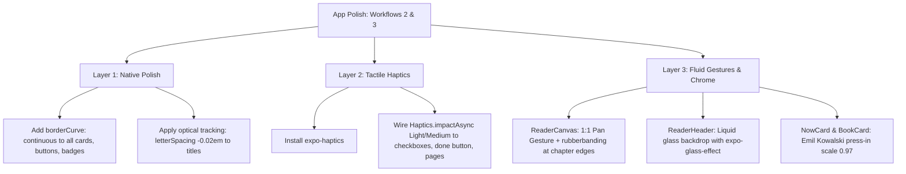

# Implementation Plan: Native Polish & Fluid Gestures (Workflows 2 & 3)

Apply **Workflow 2 (Visual System & Native Platform Layout)** and **Workflow 3 (Apple Fluid Gestures & Tactile Motion)** to transform the app into an authentic, tactile iOS experience that feels like physical hardware.

---

## 1. Goal Description

Elevate the app across both the **E-Ink Reader** and **ADHD Focus To-Do** experiences by combining:
1. **Workflow 2 (`/scandinavian-design` + `/expo-native-ui`)**:
   - Continuous squircle curves (`borderCurve: 'continuous'`) on all surfaces.
   - Optical letter-spacing (`-0.02em` on headings, neutral on body).
   - Translucent floating glass chrome (`expo-glass-effect`) on reader headers and toolbars with content scrolling underneath.
   - Native automatic scroll insets (`contentInsetAdjustmentBehavior="automatic"`).
2. **Workflow 3 (`/apple-design` + `/emil-design-eng`)**:
   - Multimodal tactile feedback via `expo-haptics` (sub-frame audio-haptic harmony on checkbox clicks, task completions, page turns, and timer events).
   - Immediate press-down feedback (`scale: 0.97`) on all interactive cards, links, and buttons.
   - Interactive 1:1 horizontal pan gesture in `ReaderCanvas` with progressive rubber-banding at boundaries and momentum projection on release.

---

## 2. User Review Required

> [!IMPORTANT]
> - **Dependency Addition**: We will install `expo-haptics` via `npx expo install expo-haptics` to enable physical Taptic Engine feedback on iOS devices and simulators.
> - **Gesture Handler Integration**: We will enhance `ReaderCanvas` with `GestureDetector` / `PanGesture` from `react-native-gesture-handler` for fluid horizontal swiping, while preserving existing tap zones for one-handed reading.

---

## 3. Proposed Changes



---

### Component Layer A: Design Tokens & Typography ([`src/constants/theme.ts`](file:///Users/cesaradalbertochavezcalderon/Personal/expo-learning/src/constants/theme.ts) & [`src/components/themed-text.tsx`](file:///Users/cesaradalbertochavezcalderon/Personal/expo-learning/src/components/themed-text.tsx))

#### [MODIFY] `src/components/themed-text.tsx`
- Add optical letter-spacing tables based on Apple HIG:
  - `title`: `letterSpacing: -0.5`, `lineHeight: 32`
  - `subtitle`: `letterSpacing: -0.2`, `lineHeight: 24`
  - `tabular-nums` helper for timers and chapter counters.

---

### Component Layer B: Tactile Feedback & Multimodal Haptics

#### [NEW] `src/services/haptics.ts`
- Create a lightweight, safe haptic utility wrapper that triggers:
  - `triggerLightImpact()`: On micro-step toggle, tab switch, page turn.
  - `triggerSuccessNotification()`: On "Mark Complete" / task finished.
  - `triggerSelectionChanged()`: On settings drawer slider/segmented control.

---

### Component Layer C: ADHD Focus Tasks Screen & Components

#### [MODIFY] [`src/components/tasks/now-card.tsx`](file:///Users/cesaradalbertochavezcalderon/Personal/expo-learning/src/components/tasks/now-card.tsx)
- Add `borderCurve: 'continuous'` to the container, `FOCUS NOW` badge, timer badge, and `Mark Complete` button.
- Add `Haptics.notificationAsync(Success)` to the `onComplete` handler.
- Add Emil Kowalski press animation (`scale: 0.97`) to the `Skip` / `Later` button.

#### [MODIFY] [`src/components/tasks/task-item.tsx`](file:///Users/cesaradalbertochavezcalderon/Personal/expo-learning/src/components/tasks/task-item.tsx)
- Add `borderCurve: 'continuous'` to the card container, checkbox, and `Focus Now` button.
- Fire light haptic tap on checkbox toggle.

#### [MODIFY] [`src/components/tasks/quick-capture.tsx`](file:///Users/cesaradalbertochavezcalderon/Personal/expo-learning/src/components/tasks/quick-capture.tsx)
- Add `borderCurve: 'continuous'` to the input bar.
- Fire light haptic tap on task submission.

#### [MODIFY] [`src/app/tasks.tsx`](file:///Users/cesaradalbertochavezcalderon/Personal/expo-learning/src/app/tasks.tsx)
- Add `borderCurve: 'continuous'` to navigation buttons (`Library`, `Arch`).
- Add smooth Reanimated entering/exiting transitions (`FadeInDown`, `FadeOutUp`) when tasks transition between `Now`, `Later`, and `Done`.

---

### Component Layer D: E-Ink Reader Screen & Fluid Gestures

#### [MODIFY] [`src/components/reader/reader-canvas.tsx`](file:///Users/cesaradalbertochavezcalderon/Personal/expo-learning/src/components/reader/reader-canvas.tsx)
- Wrap in a `GestureDetector` with a horizontal `PanGesture`:
  - **1:1 tracking**: Follows finger offset during active swipe.
  - **Rubber-banding**: If dragging past first page or last page, apply progressive logarithmic resistance ($x_{drag} \times 0.3$).
  - **Velocity handoff**: Release gesture projects velocity (`vx > 400px/s` or swipe offset `> 60px`) to trigger next/previous page flip smoothly.
  - **Multimodal**: Trigger light haptic on page turn commitment.

#### [MODIFY] [`src/components/reader/reader-header.tsx`](file:///Users/cesaradalbertochavezcalderon/Personal/expo-learning/src/components/reader/reader-header.tsx)
- Upgrade background from flat solid to liquid glass overlay using `expo-glass-effect` or translucent blurred backdrop with `borderCurve: 'continuous'`.

#### [MODIFY] [`src/components/reader/book-card.tsx`](file:///Users/cesaradalbertochavezcalderon/Personal/expo-learning/src/components/reader/book-card.tsx) & [`src/app/index.tsx`](file:///Users/cesaradalbertochavezcalderon/Personal/expo-learning/src/app/index.tsx)
- Add `borderCurve: 'continuous'` to book covers, hero card, and header action buttons.
- Add immediate press feedback (`scale: 0.98`) to `BookCard`.

---

## 4. Verification Plan

### Automated Verification
```bash
./init.sh
```
- Verify 0 TypeScript type errors.
- Verify all existing unit tests in `task-service.test.ts`, `book-repository.test.ts`, and `epub-parser.test.ts` continue to pass 100%.

### Manual UI & Gesture Verification
1. **iOS Simulator**:
   - Open Library (`/`): Confirm all cards, buttons, and badges have continuous squircle curves.
   - Open Focus (`/tasks`):
     - Tap input bar, dump a task, check immediate response.
     - Tap checkbox on a micro-step: confirm tactile spring response.
     - Tap "Mark Complete": confirm spring scale down and smooth state transition to Done list.
   - Open Reader (`/reader/[id]`):
     - Swipe left/right across the page: confirm 1:1 finger tracking, rubber-banding at boundaries, and page transition on flick release.
     - Tap top to show header: confirm liquid glass material backdrop.
