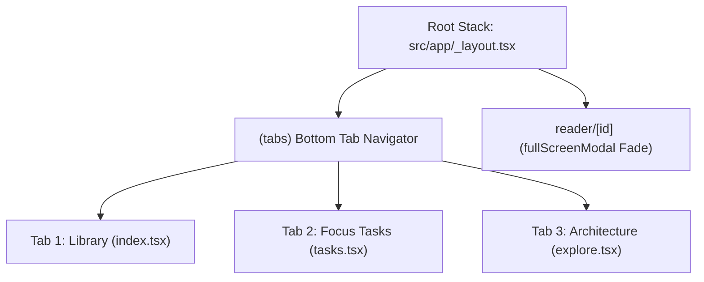

# Implementation Plan: Ergonomic Native Bottom Tabs

Migrate top-level navigation from unreachable header buttons into a native **Bottom Tab Bar**, solving the thumb-zone ergonomic problem while keeping the E-Ink reader completely distraction-free in a fullscreen modal.

---

## 1. Goal Description & Ergonomic Problem

### The Problem
Top-level navigation (`Library`, `Focus`, `Architecture`) currently lives in the screen header at the top-right (`y ≈ 60px`). On modern smartphones (iPhone 16/17, Pro Max), the top-right corner is outside the natural **Thumb Zone** (Apple HIG ergonomics), making single-handed navigation strained and awkward.

### The Solution
Implement an Expo Router **`(tabs)`** structure with a native bottom tab bar:
1. **Ergonomic Bottom Thumb Zone**: Instant 1-tap switching between:
   - 📚 **Library** (`/`): Bookshelf, EPUB import, continue reading hero.
   - 🎯 **Focus** (`/tasks`): ADHD single-task focus card, brain dump, micro-steps.
   - 🏛️ **Architecture** (`/explore`): Architecture, conventions, and system design.
2. **Distraction-Free Reader**:
   - The reader (`/reader/[id]`) remains in the root Stack as a `presentation: 'fullScreenModal'`, covering the tab bar completely for deep immersion.
3. **Clean Up Headers**:
   - Remove the crowded `styles.headerActions` navigation buttons from `index.tsx`, `tasks.tsx`, and `explore.tsx`, leaving headers clean, focused, and purposeful.

---

## 2. Navigation Architecture Diagram



---

## 3. Proposed Changes

### Component Layer: Route Structure & Navigation

#### [NEW] `src/app/(tabs)/_layout.tsx`
Create the bottom tab navigator with:
- Translucent frosted glass bar (`borderTopColor`, `backgroundColor`).
- Native Apple SF Symbols via `SymbolView` (or `NativeTabs`):
  - Library: `books.vertical.fill` / `books.vertical`
  - Focus: `target` / `checkmark.circle.fill`
  - Architecture: `compass` / `square.stack.3d.up`
- Haptic feedback (`triggerSelectionChange()`) on tab switch.

#### [MOVE/RESTRUCTURE]
- Move `src/app/index.tsx` ➔ `src/app/(tabs)/index.tsx`
- Move `src/app/tasks.tsx` ➔ `src/app/(tabs)/tasks.tsx`
- Move `src/app/explore.tsx` ➔ `src/app/(tabs)/explore.tsx`

#### [MODIFY] `src/app/_layout.tsx`
Configure the root Stack:
```tsx
<Stack screenOptions={{ headerShown: false }}>
  <Stack.Screen name="(tabs)" options={{ headerShown: false }} />
  <Stack.Screen
    name="reader/[id]"
    options={{
      presentation: 'fullScreenModal',
      animation: 'fade',
      headerShown: false,
    }}
  />
</Stack>
```

#### [MODIFY] Screen Headers (`(tabs)/index.tsx`, `(tabs)/tasks.tsx`, `(tabs)/explore.tsx`)
- Remove redundant header navigation buttons (`Library`, `Focus`, `Arch`), keeping only context-specific actions (e.g., `Import EPUB` in the Library).

---

## 4. Verification Plan

### Automated Verification
```bash
./init.sh
```
- Verify 0 TypeScript compilation errors with the new file routes.
- Verify all 10 unit tests pass 100%.

### Manual UI Verification in Simulator
1. Confirm the bottom tab bar is visible with 3 tabs: Library, Focus, Architecture.
2. Tap each tab: verify instantaneous switching and haptic tick.
3. Open a book in Library: confirm the Reader opens full-screen without any bottom tabs visible.
4. Tap Back in the reader header: confirm returning cleanly to the Library tab.
